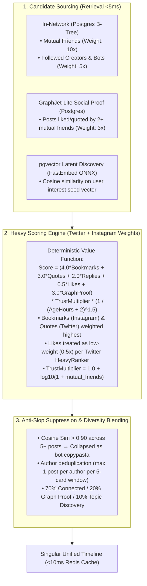
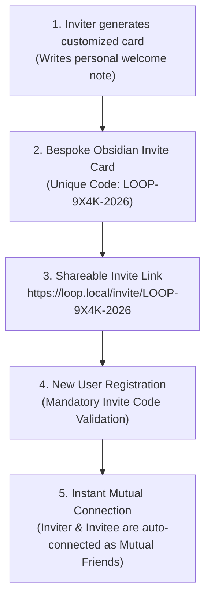
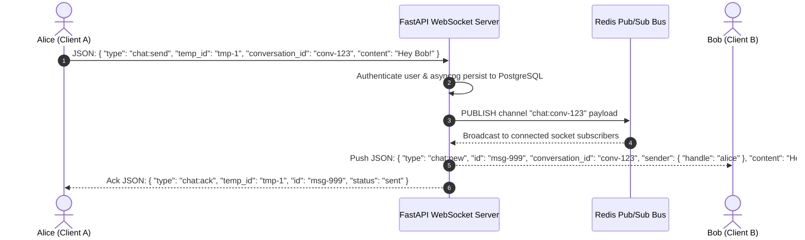
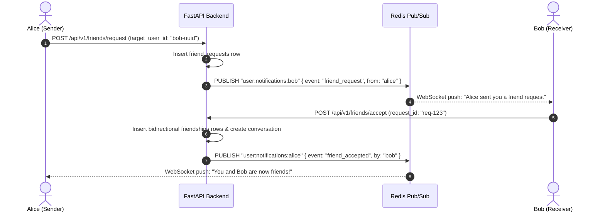

# ⚡ Project LOOP — Master Design & Architecture Specification

> **The Vision**: The definitive **universal pure-text social platform with Discord-grade ephemeral real-time voice & chat**, combining the absolute best of **Discord, WhatsApp, X (Twitter), Telegram, and Substack** in a jaw-dropping **Technical Authenticity & Quiet Luxury aesthetic** (5-tier obsidian surface ladder + Modern Apple Blue `#007aff` and Bright Apple Green `#30d158` accents). Built for **everyone—writers, thinkers, creators, friends, and communities**—around an **exclusive invite-only gating mechanism**, a **frictionless 1-Way Follow + Automatic Mutual Friends security shield**, and a **Singular Unified Timeline** (70% Friends & Followed / 20% Social Graph Proof / 10% Topic Discovery). **100% solid, flat, and opaque—zero glassmorphism, zero transparency, zero frosted blur.** Designed specifically for **minimal server load and zero persistent audio storage**: pure high-density text, sub-20ms instant chat, offline-first PWA text sync, zero-asset Web Audio procedural synthesizers, and ephemeral <40ms voice channels that stream purely in-memory with **0 bytes stored on disk**.

---

## 1. The Best of Discord, WhatsApp, X, Telegram & Substack (Feature Matrix)

```mermaid
flowchart TD
    subgraph Giants ["The 5 Best-of-Breed Foundations"]
        Discord["Discord\n• 1-Tap Persistent Ephemeral Voice Lounges (0 Bytes Disk Storage)\n• Input/Output Device Selector + Mic Test Live VU Bar\n• Auto-Reconnect with Fast ICE Restart (<500ms)\n• Voice Activity Detection (VAD) & Active Speaker Bright Green Glow Rings"]
        WhatsApp["WhatsApp\n• Sub-20ms Direct Messages with zero spam (Mutual Friends Only)\n• Read receipts & delivery ticks (✓, ✓✓, ✓✓ blue)\n• In-reply-to quote preview bubbles in chat\n• Pinned top conversations & fast split-pane desktop messaging"]
        X["𝕏 / Twitter\n• Micro-post composer (≤300 chars) with live SVG progress ring\n• Connected Thread Chaining (1/N) & Hotkey publishing (Cmd+Enter)\n• 1-Tap Micro-Polls, Quotes & Reposts\n• HeavyRanker Scoring: Bookmarks & Quotes >> Likes"]
        Substack["Substack\n• Singular Unified Timeline with 70/20/10 smart blending\n• 1-Way Broadcast Circles / Publications with reading time\n• Peer-to-peer friend recommendations\n• Editorial typography and distraction-free reader view"]
        Telegram["Telegram\n• Bespoke Shareable Invite Cards & Exclusive Gating\n• @LoopFather Conversational Bot Engine\n• 'Saved Messages' personal private cloud scratchpad\n• Keyboard-first shortcuts & instant navigation"]
    end

    subgraph ProductCore ["LOOP's Zero-Bloat Pure-Text Engine"]
        Invites["🎟️ Bespoke Invite Gating\n5 Invites/mo quota + Backdoor for @vineetkishore"]
        Friends["🤝 Follow + Mutual Security Shield\n1-Tap follow any creator; mutual follows auto-unlock DMs & Voice."]
        Stream["⚡ Singular Unified Stream\n70% In-Network / 20% Graph Proof / 10% Latent Topics (<10ms)"]
        Voice["🎙️ 1-Tap Ephemeral LiveKit Voice Lounges\nDrop in/out freely, WebRTC SFU in RAM (0 bytes saved to disk)"]
        Design["🎨 5-Tier Obsidian Surface Ladder + Apple Blue (#007aff) & Bright Green (#30d158)\n100% Solid matte surfaces with 1px precision optical hairlines"]
    end

    Giants --> ProductCore
```



---

## 2. The 5 Core Application Screens

### Screen 1: The Stream (`/`) — *The Singular Unified Timeline & Human Pulse*
1. **The Singular Unified Timeline (Zero Tab Friction)**:
   - Eliminates split tabs into **one intelligent, continuous stream** that blends:
     - **70% In-Network**: Thoughts from your **Mutual Friends** (top priority) and **Followed Creators/Bots**.
     - **20% Social Graph Discovery**: Thoughts your mutual friends have liked, quoted, or bookmarked (*"Liked by Sarah and David"*).
     - **10% High-Signal Topic Discovery**: High-relevance, anti-slop verified insights from across the broader community.
   - **Transparent Attribution Badges**: Every post displays a crisp context pill (`🤝 Mutual Friend`, `Following`, `✦ Discovered via Graph`, `✦ Trending in #systems`).
   - **Peace of Mind Filter**: An optional 1-tap chip at the top (`All (Unified)` $\longleftrightarrow$ `🤝 Mutuals Only`) allows users to instantly isolate close friends with zero page reload.
2. **Micro-Post Velocity & Composer (≤300 chars)**:
   - Sits at the top of the feed with an auto-growing textarea and global hotkey access (<kbd>n</kbd> anywhere).
   - Live Apple Blue circular SVG progress ring as you type (shifts to Amber at 280 chars, Red at 300).
   - **Connected Thread Chaining (`1/N`)**: 1-Tap `[ + Add to Thread ]` to chain connected micro-thoughts into an unrollable narrative before publishing in 1 keystroke (`Cmd + Enter`).
   - **Auto-Saving Local Drafts Drawer**: Preserves in-progress thoughts across sessions.
   - **Interactive Micro-Polls**: 1-Tap create 2–4 option text polls with instant numeric odometer percentage reveals (stored as lightweight text arrays, minimal DB size).
   - Rich text formatting: Bold (`**`), Italic (`*`), Inline Code (`` `code` ``), and Blockquotes (`>`).
3. **Feed Consumption & Amplification Velocity**:
   - **Floating Live Updates Pill (`"↑ 3 New Thoughts"`)**: Real-time WebSocket indicator floating at the top of the feed when friends post; 1-tap smooth glides to newest thoughts.
   - **Inline Thread Unroll Accordion**: 1-Tap `"Show this thread"` inline expansion without page reloads or losing scroll position.
   - **Like / Heart**: Tactile numeric odometer ticker (`tabular-nums`) with 120ms spring scale bounce (`scale(1.2) -> scale(1.0)`) and Pink/Red (`#ff375f`) glow.
   - **Repost / Echo**: 1-Tap repost directly to your mutual friends.
   - **Quote Thought**: Repost with your own commentary attached above the original card.
   - **Threaded Nested Replies**: Clean vertical connector hairlines with indented responses.
   - **Bookmark / Save**: 1-Click save to your private `Bookmarks` tab with tag organization.
   - **Post Edit Window**: Edit typos within 15 minutes of posting (displays a subtle `(edited)` label).
   - **Pin to Profile**: Pin up to 3 of your best thoughts to the top of your profile.
   - **Emoji Micro-Reactions**: Add instant reactions (`🔥`, `⚡`, `❤️`, `👀`, `🧠`, `🚀`) below any post.
   - **Smart Text-First Link Previews**: Lightweight, zero-tracking URL cards for articles, books, and essays.
   - **Power-User Keyboard Accelerators**: <kbd>n</kbd> (New Post), <kbd>j</kbd> / <kbd>k</kbd> (Traverse Feed), <kbd>l</kbd> (Like), <kbd>r</kbd> (Quick Reply), <kbd>/</kbd> (Search).

---

### Screen 1.1: Hybrid Recommendation Engine (Twitter HeavyRanker + Instagram Multi-Task Model)
To deliver an addictive, high-signal, anti-slop feed within a lightweight, open-source tech stack, LOOP combines the best architectural patterns from **Twitter's Open-Sourced Algorithm** (`twitter/the-algorithm`) and **Meta Instagram's Multi-Task Funnel**:



#### 1. Candidate Retrieval Pipeline (Sourcing in $<5\text{ms}$)
- **In-Network Stream**: Single compound index scan on `posts(author_id, created_at desc)` for mutuals and followed entities ($<1\text{ms}$).
- **GraphJet-Lite Social Proof**: Identifies out-of-network thoughts that $\ge 2$ mutual friends have liked or quoted ($<2\text{ms}$).
- **Semantic Vector Discovery**: Generates an 80MB CPU vector embedding (`all-MiniLM-L6-v2`) from user's recent bookmarks/likes and queries `posts.embedding` via HNSW vector index ($<4\text{ms}$).

#### 2. The Heavy Value Scoring Formula
$$\text{RankScore} = (4.0 \cdot \text{Bookmarks} + 3.0 \cdot \text{Quotes} + 2.0 \cdot \text{Replies} + 0.5 \cdot \text{Likes} + 3.0 \cdot \text{GraphProof}) \times \text{TrustMultiplier} \times \frac{1}{(\text{AgeInHours} + 2)^{1.5}}$$

* **Why Bookmarks ($4.0\times$) & Quotes ($3.0\times$) Rule**: Inspired by Meta’s finding that saves drive long-term retention and Twitter’s finding that retweets drive public discourse.
* **Why Likes are $0.5\times$**: Direct from Twitter's open-source `HeavyRanker`, preventing low-effort clickbait from gaming the feed.
* **TrustMultiplier**: $1.0 + \log_{10}(1 + \text{mutual\_friends\_count})$ guarantees bots with 0 friends cannot infiltrate the timeline.

#### 3. Re-Ranking & Anti-Slop Rules
* **Anti-Copypasta**: Automatically suppresses near-duplicate posts (cosine similarity $> 0.90$) produced by syndication bots.
* **Anti-Fatigue Author Deduplication**: Never shows two posts from the same author in a consecutive 5-post window.
* **70 / 20 / 10 Interleaving**: 70% Friends & Followed, 20% Graph-Neighbor Discovery, 10% Serendipitous Topics.

---

### Screen 2: The Lounges (`/voice`) — *Ephemeral Drop-In Audio Hub (0 Bytes Disk Storage)*
1. **1-Tap Voice Channel Drop-in**:
   - Click any voice channel (e.g. `🔊 #general-lounge`, `🔊 #reading-room`, `🔊 #music-lounge`) to immediately connect to the audio room.
   - **100% In-Memory WebRTC SFU**: Audio streams directly between participants through LiveKit SFU with **zero audio recordings or files stored on the server disk**.
   - Channel participant list shows which friends are currently inside with **Bright Green (`#30d158`) active speaking rings**.
   - Leave whenever you want with `Esc` or the Disconnect button.
2. **Discord-Style Audio Hardware Settings (`Settings -> Voice & Audio`)**:
   - **Input Device Selector (Microphone)**: Real-time dropdown populated via `navigator.mediaDevices.enumerateDevices()`.
   - **Output Device Selector (Headphones/Speakers)**: Dropdown with output sink routing via `HTMLMediaElement.setSinkId()`.
   - **"Let's Check Your Mic" Live VU Meter**: Animated green decibel level bar + zero-latency audio loopback test.
   - **Input Sensitivity Gate**: Auto-sensitivity toggle or manual slider (`-100 dB` to `0 dB`).
   - **Hardware DSP Switches**: Dedicated toggles for Echo Cancellation, Noise Suppression, and Auto Gain Control.
3. **Persistent Floating Voice Dock (Global)**:
   - When connected, a solid obsidian dock floats at the bottom left across all routes:
     `🟢 In Voice: #general (18ms ping) · 🎙️ Mute (M) · 🎧 Deafen (D) · ⚙️ Audio Settings · 🔴 Disconnect (Esc)`
   - Browse the feed, write posts, or chat in DMs while talking in real-time with zero audio interruption.
4. **Seamless Auto-Reconnection & Fast ICE Restart**:
   - If the user's Wi-Fi drops, switches to cellular, or encounters network jitter, the WebRTC engine initiates an **instant ICE Restart within <500ms** without dropping the audio session.
   - Connection State Indicator: Live ping meter in milliseconds (`🟢 18ms`, `🟡 110ms`, `🔴 Reconnecting...`).
   - Silent JWT Token Refresh: Background token rotation so multi-hour voice sessions never disconnect.
5. **Per-User Volume Sliders (0% to 200%)**:
   - Right-click / hover any participant in a voice channel to adjust their individual volume from **0% to 200%**.
   - Discontinuous Transmission (DTX) drops bandwidth to 0 kbps when silent.
6. **Zero-Asset Procedural Web Audio Earcons**:
   - Synthesized on-the-fly in browser RAM using Web Audio API oscillators: join chime, leave chime, mute toggle click (0 bytes downloaded over network).

---

### Screen 3: The Split-Pane Chat (`/messages`) — *WhatsApp / Signal Speed & Pure Text*
1. **Split-Pane Ergonomics (340px Left Rail + Fluid Chat Viewport)**:
   - Left list shows mutual friends with live green presence dots, last message preview, unread count badges, and pinned chats.
2. **WhatsApp-Style Read Receipts**:
   - `✓` Sent to server.
   - `✓✓` Delivered to friend's active socket.
   - `✓✓` (Modern Apple Blue) Read by friend.
3. **Sub-20ms Pure Text Messaging**:
   - Instant text transmission with zero media payload overhead. 1,000,000 messages take only ~100MB in PostgreSQL.
4. **Live Typing Indicators & Presence (Discord Style)**:
   - Rhythmic 3-dot breathing animation: *"Sarah is typing..."*.
   - Live **Bright Green status dot (`#30d158`)** (`online` / `offline`) + custom status snippet.
5. **In-Chat Quoted Replies & Code Fences**:
   - Click or swipe reply on any message to anchor a quote bubble with a 3px Apple Blue vertical bar.
   - Multi-line syntax-highlighted code blocks.
6. **Emoji & Micro-Reactions**:
   - Add instant reactions (`🔥`, `⚡`, `❤️`, `👀`, `🧠`, `🚀`) below any chat message.
7. **In-Chat Message Search**:
   - Search through the message history of any friend conversation with live keyword highlighting.
8. **"Saved Messages" (Telegram Style)**:
   - Dedicated private scratchpad conversation with yourself to jot down notes, draft thoughts, and store links.

---

### Screen 4: Broadcast Circles (`/circles`) — *Telegram-Style 1-Way Channels*
1. **Creator & Writer Broadcast Publishing**:
   - Users can create 1-way text broadcast circles (e.g. `@alex/systems`, `@sarah/rust-notes`, `@elena/music-journal`) to publish long-form notes, essays, updates, or changelogs.
2. **100% Guaranteed Delivery**:
   - Zero algorithmic suppression. Every subscriber receives the broadcast in their Circles feed in real-time.
3. **Threaded Community Discussions**:
   - Subscribers can tap into a dedicated nested discussion thread under any broadcast post to discuss insights.

---

### Screen 5: The Identity & Vault (`/@handle`) — *Your Digital Presence*
1. **User Identity Header**:
   - 72px avatar with **Bright Green Online Presence Dot (`#30d158`)**.
   - Display name, `@handle`, bio (≤280 chars), custom status, joined date.
   - **Focus / Quiet Mode Status Presets**:
     - `🌙 In Focus / Quiet Hours`, `📚 Reading`, `🎧 Listening`, `✈️ Traveling`, `🏃 Out`.
   - Stats Bar: `🤝 48 Mutual Friends`, `✍️ 124 Thoughts`, `🎟️ 5 Invites Left`.
   - **Dynamic Relationship Action Buttons**:
     - If not connected: Solid Apple Blue **`[ + Follow ]`**
     - If mutual friends: **`[ 🤝 Mutual Friends ]`** + **`[ 💬 Message ]`** + **`[ 🔊 Voice ]`**
2. **The 4 Content Tabs**:
   - `Thoughts`: Authored root posts (with up to 3 pinned thoughts at top).
   - `Replies / Threads`: Nested public discussions and thread conversations.
   - `Likes`: Thoughts liked by this user.
   - `Bookmarks 🔒`: Private personal vault of saved thoughts with tag filters (visible only to you).

---

### Screen 5.1: The Bespoke Invite Card Generator & Social Proof Gating (`/invites`)
Project LOOP is strictly **Invite-Only** to preserve conversational intimacy, guarantee high social proof, and eliminate automated bot networks.



1. **Mandatory Invite Code Registration**:
   - A valid, unclaimed 8-character invite code (e.g. `LOOP-9X4K-2026`) is required on the sign-up form. Registration without a verified invite code is blocked.
2. **Bespoke Shareable Invite Card**:
   - Users can generate a customized obsidian card with:
     - Personalized welcome message / quote from the inviter.
     - Inviter's verified badge and handle (*"Invited by @alex"*).
     - Single-tap Copy Code & Share Link (`https://loop.local/invite/{code}`).
3. **Monthly Quota & Developer Superuser Backdoor**:
   - **Standard Member Quota**: Maximum **5 invites per calendar month** to maintain extreme scarcity, prestige, and high social proof.
   - **Developer Backdoor (@vineetkishore)**: User handle `@vineetkishore` (and any account with `is_superuser = true`) possesses **unlimited invite generation capabilities**, completely bypassing the monthly 5-invite quota.
4. **Instant Mutual Friend Bootstrap**:
   - The moment a new user completes sign-up using an invite code, a bidirectional `friendships` entry is automatically committed between the inviter and invitee.
   - The newcomer's feed and DMs are immediately lively from second zero.

---

### Navigation: Global Command Palette (`Cmd + K`), Search & Offline Sync
1. **Global Command Palette (`Cmd + K`)**:
   - Jump to any friend (`@alex`), join a voice channel (`🔊 #general`), open a chat (`#sarah`), navigate tabs, or trigger a new post in 1 keystroke.
2. **Live Search**:
   - Search users by name/handle, voice channels, and community posts by keyword or hashtag (`#minimalism`).
3. **Privacy & Security Settings**:
   - Online Presence: Toggle whether friends can see when you are active.
   - Voice Privacy: Choose input/output audio devices and test sensitivity.
4. **Offline PWA & Optimistic Sync Engine**:
   - Progressive Web App manifest + Service Worker caching shell & recent feeds.
   - IndexedDB outbox queue: Draft thoughts, write DMs, or like posts while offline (e.g. in subway, flight).
   - Instant optimistic UI badge (`⏳ Queued Offline`) with automatic flush & dispatch when `navigator.onLine` fires.

---

## 3. The 2026 "Technical Authenticity & Quiet Luxury" Design System

### 3.1 5-Tier Obsidian Surface Ladder (`globals.css`)
**100% Solid & Opaque.** Depth is achieved through micro-luminance elevation rather than muddy drop shadows or translucent blur:

```css
:root {
  /* 5-Tier Obsidian Surface Ladder (Pitch Black -> Layered Matte Charcoal) */
  --bg-canvas: #050507;             /* Tier 1: Viewport Base Void */
  --bg-surface-0: #09090c;          /* Tier 2: Structural Nav Rail & Sidebar */
  --bg-surface-1: #0e0e12;          /* Tier 3: Post Cards & Message Bubbles */
  --bg-surface-2: #15151b;          /* Tier 4: Elevated Composers, Popovers, Dialogs */
  --bg-surface-hover: #1c1c24;      /* Tier 5: High-Responsiveness Hover Rows */
  --bg-surface-active: #24242f;     /* Pressed State */

  /* Precision Optical Hairlines (Crisp 1px solid lines) */
  --border-subtle: rgba(255, 255, 255, 0.07); /* Resting separator */
  --border-medium: rgba(255, 255, 255, 0.16); /* Hover state */
  --border-strong: rgba(255, 255, 255, 0.28); /* Active modal edge */
  --border-focus: #007aff;                    /* Apple Blue focus ring */

  /* High-Scannability Typography */
  --text-high: #f4f4f6;             /* Primary text: crisp off-white (15:1 contrast) */
  --text-medium: #8e8e93;           /* Secondary text: classic Apple silver */
  --text-subtle: #636366;           /* Tertiary text: timestamps, handles */
  --text-muted: #3a3a3c;            /* Disabled states, subtle placeholders */

  /* Modern Apple Blue Suite (Primary Actions, CTAs, Badges) */
  --apple-blue: #007aff;            /* Solid primary action blue */
  --apple-blue-hover: #0066d6;      /* Solid hover state for primary buttons */
  --apple-blue-subtle: rgba(0, 122, 255, 0.14); /* Badge & selection background */
  --apple-blue-glow: 0 0 16px rgba(0, 122, 255, 0.25);

  /* Modern Bright Green Suite (Live Voice, Active Mic, Online Presence) */
  --bright-green: #30d158;          /* Solid Apple Bright Green for mic/voice */
  --bright-green-glow: 0 0 16px rgba(48, 209, 88, 0.35); /* Active speaker avatar ring */
  --bright-green-subtle: rgba(48, 209, 88, 0.14); /* In-voice status chip */

  /* Auxiliary Semantic Accents */
  --status-danger: #ff453a;         /* Solid Apple Red for Disconnect & Muted mic */
  --status-warning: #ff9f0a;        /* Solid Apple Amber for Deafened state */
  --reaction-heart: #ff375f;        /* Solid Apple Pink for active Like hearts */

  /* Typography & Layout Metrics */
  --font-sans: 'Inter', -apple-system, BlinkMacSystemFont, 'Segoe UI', Roboto, sans-serif;
  --font-mono: 'JetBrains Mono', monospace;
  --radius-sm: 6px;
  --radius-md: 10px;
  --radius-lg: 14px;
}
```

### 3.2 Power-User Keyboard Navigation
| Shortcut | Action | Scope |
| :--- | :--- | :--- |
| **`j` / `k`** | Move focus down / up to the next post card | Global Feed |
| **`n`** | Open global quick-post modal | Global |
| **`c`** | Focus chat / jump to conversations | Global |
| **`m`** | Toggle microphone Mute / Unmute (when in voice channel) | Voice Dock |
| **`d`** | Toggle Deafen / Undeafen (when in voice channel) | Voice Dock |
| **`Esc`** | Disconnect voice / Close modal / collapse split-pane | Modals & Voice |
| **`/`** | Focus search input | Global |
| **`Cmd + K` / `Ctrl + K`** | Open command palette (Jump to friend, voice channel, call) | Global |
| **`Cmd + Enter`** | Submit post or reply | Composers |
| **`Enter`** | Send message (Shift+Enter for newline) | Chat input |
| **`l`** | Like the currently highlighted post | Feed |
| **`r`** | Reply to the currently highlighted post | Feed |

---

## 4. Containerized Infrastructure (`docker-compose.yml`)

The platform is 100% self-contained across 5 Docker containers:

```yaml
version: '3.8'

services:
  frontend:
    build:
      context: ./frontend
      dockerfile: Dockerfile
    container_name: loop_frontend
    ports:
      - "3000:3000"
    environment:
      - NEXT_PUBLIC_API_URL=http://localhost:8000/api/v1
      - NEXT_PUBLIC_WS_URL=ws://localhost:8000/ws
      - NEXT_PUBLIC_LIVEKIT_URL=ws://localhost:7880
    depends_on:
      backend:
        condition: service_healthy
    restart: unless-stopped

  backend:
    build:
      context: ./backend
      dockerfile: Dockerfile
    container_name: loop_backend
    ports:
      - "8000:8000"
    environment:
      - DATABASE_URL=postgresql+asyncpg://loop_user:loop_password@db:5432/loop_db
      - REDIS_URL=redis://redis:6379/0
      - LIVEKIT_API_KEY=devkey
      - LIVEKIT_API_SECRET=secret_dev_key_for_livekit_voice_service_32bytes
      - LIVEKIT_URL=http://livekit:7880
      - JWT_SECRET=loop_dev_secret_key_change_in_production_32bytes
      - JWT_ALGORITHM=HS256
      - ACCESS_TOKEN_EXPIRE_MINUTES=10080
    depends_on:
      db:
        condition: service_healthy
      redis:
        condition: service_healthy
      livekit:
        condition: service_started
    healthcheck:
      test: ["CMD", "python", "-c", "import urllib.request; urllib.request.urlopen('http://localhost:8000/health')"]
      interval: 5s
      timeout: 3s
      retries: 5
    restart: unless-stopped

  livekit:
    image: livekit/livekit-server:latest
    container_name: loop_livekit
    command: --dev --bind 0.0.0.0
    ports:
      - "7880:7880"                # LiveKit WebSocket Signaling
      - "50000-50050:50000-50050/udp" # WebRTC SFU Audio Stream
    environment:
      - LIVEKIT_KEYS=devkey: secret_dev_key_for_livekit_voice_service_32bytes
    restart: unless-stopped

  db:
    image: pgvector/pgvector:pg16
    container_name: loop_db
    environment:
      - POSTGRES_USER=loop_user
      - POSTGRES_PASSWORD=loop_password
      - POSTGRES_DB=loop_db
    volumes:
      - loop_postgres_data:/var/lib/postgresql/data
      - ./backend/init.sql:/docker-entrypoint-initdb.d/init.sql
    ports:
      - "5432:5432"
    healthcheck:
      test: ["CMD-SHELL", "pg_isready -U loop_user -d loop_db"]
      interval: 5s
      timeout: 3s
      retries: 5
    restart: unless-stopped

  redis:
    image: redis:7-alpine
    container_name: loop_redis
    ports:
      - "6379:6379"
    volumes:
      - loop_redis_data:/data
    healthcheck:
      test: ["CMD", "redis-cli", "ping"]
      interval: 5s
      timeout: 3s
      retries: 5
    restart: unless-stopped

volumes:
  loop_postgres_data:
  loop_redis_data:
```

---

## 5. PostgreSQL Database Schema (Full Relational DDL + pgvector)

```sql
create extension if not exists "pgcrypto";
create extension if not exists "pg_trgm";
create extension if not exists "vector";

-- 1. Users table (Auth, Identity & Invite Tracking)
create table users (
    id uuid primary key default gen_random_uuid(),
    handle varchar(32) unique not null check (handle ~ '^[a-zA-Z0-9_]{3,32}$'),
    email varchar(255) unique not null,
    password_hash varchar(255) not null,
    display_name varchar(64) not null,
    bio varchar(280) default '',
    custom_status varchar(64) default '',
    trust_score double precision default 1.0,
    is_superuser boolean default false,                        -- Backdoor for @vineetkishore (unlimited invites)
    invited_by_id uuid references users(id) on delete set null,
    created_at timestamptz default now(),
    updated_at timestamptz default now()
);
create index idx_users_handle on users(handle);

-- 1.1 Bespoke Invites Table
create table invites (
    id uuid primary key default gen_random_uuid(),
    code varchar(32) unique not null check (code ~ '^[A-Z0-9\-]{6,32}$'),
    inviter_id uuid not null references users(id) on delete cascade,
    custom_message text,                                       -- Custom note on the bespoke card
    claimed_by_id uuid references users(id) on delete set null,
    is_claimed boolean default false,
    claimed_at timestamptz,
    expires_at timestamptz not null default (now() + interval '30 days'),
    created_at timestamptz default now()
);
create index idx_invites_code on invites(code) where is_claimed is false;
create index idx_invites_inviter_created on invites(inviter_id, created_at desc);

-- 2. Friend Requests
create table friend_requests (
    id uuid primary key default gen_random_uuid(),
    sender_id uuid not null references users(id) on delete cascade,
    receiver_id uuid not null references users(id) on delete cascade,
    status varchar(16) not null default 'pending' check (status in ('pending', 'accepted', 'declined', 'cancelled')),
    created_at timestamptz default now(),
    updated_at timestamptz default now(),
    unique (sender_id, receiver_id)
);
create index idx_friend_requests_receiver on friend_requests(receiver_id, status);

-- 3. Mutual Friendships (Bidirectional symmetric rows)
create table friendships (
    user_id uuid not null references users(id) on delete cascade,
    friend_id uuid not null references users(id) on delete cascade,
    created_at timestamptz default now(),
    primary key (user_id, friend_id)
);
create index idx_friendships_user on friendships(user_id);

-- 3.1 Subscriptions (1-Way Follow for Creators, Writers & News Bots)
create table subscriptions (
    subscriber_id uuid not null references users(id) on delete cascade,
    target_id uuid not null references users(id) on delete cascade,
    created_at timestamptz default now(),
    primary key (subscriber_id, target_id)
);
create index idx_subs_subscriber on subscriptions(subscriber_id);
create index idx_subs_target on subscriptions(target_id);

-- 4. Posts & Thread Replies (Micro-Velocity + Chaining + Anti-Slop Vector)
create table posts (
    id uuid primary key default gen_random_uuid(),
    author_id uuid not null references users(id) on delete cascade,
    content text not null check (char_length(content) >= 1 and char_length(content) <= 300),
    parent_id uuid references posts(id) on delete cascade,         -- NULL for top-level post, UUID for reply
    thread_root_id uuid references posts(id) on delete cascade,    -- Points to root post for 1/N thread chains
    repost_of_id uuid references posts(id) on delete cascade,     -- NULL unless pure repost
    quote_of_id uuid references posts(id) on delete set null,     -- Embedded quote card
    poll_data jsonb,                                              -- Lightweight pure-text poll options
    embedding vector(384),                                        -- all-MiniLM-L6-v2 vector embedding for deduplication
    rank_score double precision default 0.0,                      -- Computed Anti-Slop Discovery Score
    is_pinned boolean default false,
    edited_at timestamptz,
    created_at timestamptz default now()
);
create index idx_posts_author_created on posts(author_id, created_at desc);
create index idx_posts_parent_id on posts(parent_id) where parent_id is not null;
create index idx_posts_thread_root on posts(thread_root_id) where thread_root_id is not null;
create index idx_posts_created_at on posts(created_at desc);
create index idx_posts_rank_score on posts(rank_score desc, created_at desc);
create index idx_posts_content_trgm on posts using gin (content gin_trgm_ops);
create index idx_posts_embedding_hnsw on posts using hnsw (embedding vector_cosine_ops);

-- 5. Likes
create table likes (
    user_id uuid not null references users(id) on delete cascade,
    post_id uuid not null references posts(id) on delete cascade,
    created_at timestamptz default now(),
    primary key (user_id, post_id)
);
create index idx_likes_post on likes(post_id);

-- 6. Bookmarks
create table bookmarks (
    user_id uuid not null references users(id) on delete cascade,
    post_id uuid not null references posts(id) on delete cascade,
    created_at timestamptz default now(),
    primary key (user_id, post_id)
);
create index idx_bookmarks_user on bookmarks(user_id, created_at desc);

-- 7. Post Emoji Reactions
create table post_reactions (
    id uuid primary key default gen_random_uuid(),
    post_id uuid not null references posts(id) on delete cascade,
    user_id uuid not null references users(id) on delete cascade,
    emoji varchar(8) not null,
    created_at timestamptz default now(),
    unique (post_id, user_id, emoji)
);
create index idx_post_reactions_post on post_reactions(post_id);

-- 8. Notifications (Activity Center)
create table notifications (
    id uuid primary key default gen_random_uuid(),
    user_id uuid not null references users(id) on delete cascade,
    actor_id uuid not null references users(id) on delete cascade,
    type varchar(32) not null check (type in ('like', 'reply', 'quote', 'repost', 'friend_request', 'friend_accept')),
    post_id uuid references posts(id) on delete cascade,
    is_read boolean default false,
    created_at timestamptz default now()
);
create index idx_notifications_user on notifications(user_id, is_read, created_at desc);

-- 9. Conversations (Direct Messages & Channels)
create table conversations (
    id uuid primary key default gen_random_uuid(),
    is_group boolean default false,
    title varchar(64),
    created_at timestamptz default now(),
    updated_at timestamptz default now()
);
create index idx_conversations_updated on conversations(updated_at desc);

-- 10. Conversation Members (Only Mutual Friends)
create table conversation_members (
    conversation_id uuid not null references conversations(id) on delete cascade,
    user_id uuid not null references users(id) on delete cascade,
    is_pinned boolean default false,
    is_muted boolean default false,
    joined_at timestamptz default now(),
    last_read_at timestamptz default now(),
    primary key (conversation_id, user_id)
);
create index idx_conv_members_user on conversation_members(user_id);

-- 11. Direct Messages
create table messages (
    id uuid primary key default gen_random_uuid(),
    conversation_id uuid not null references conversations(id) on delete cascade,
    sender_id uuid not null references users(id) on delete cascade,
    content text not null check (char_length(content) >= 1 and char_length(content) <= 2000),
    quoted_message_id uuid references messages(id) on delete set null,
    is_read boolean default false,
    edited_at timestamptz,
    created_at timestamptz default now()
);
create index idx_messages_conv_created on messages(conversation_id, created_at asc);

-- 12. Voice Channels (Discord-Style Ephemeral Audio Rooms)
create table voice_channels (
    id uuid primary key default gen_random_uuid(),
    name varchar(64) not null,
    topic varchar(255) default '',
    created_at timestamptz default now()
);

create table voice_channel_participants (
    channel_id uuid not null references voice_channels(id) on delete cascade,
    user_id uuid not null references users(id) on delete cascade,
    joined_at timestamptz default now(),
    primary key (channel_id, user_id)
);
create index idx_voice_participants_channel on voice_channel_participants(channel_id);
```

---

## 6. Real-Time WebSocket & Voice Channel Protocols

### 6.1 Sub-20ms Text Chat Dispatch (Redis Pub/Sub)


### 6.2 Friend Request WebSocket Push


---

## 7. Step-by-Step Build & Verification Sequence

1. **Scaffold Container Infrastructure**: Create `frontend/`, `backend/`, `init.sql`, and `docker-compose.yml` with all 5 services (`frontend`, `backend`, `livekit`, `db`, `redis`).
2. **Implement FastAPI Backend & Hybrid Ranking Engine**:
   - AsyncPG connection pool & JWT authentication.
   - Friend Request & 1-Way Subscription endpoints (`POST /friends/follow`, `POST /friends/unfollow`, `DELETE /friends/{id}`).
   - **Hybrid Ranking Service (`backend/app/services/ranking.py`)**:
     - *In-Network Retrieval*: B-tree indexed scan across mutual friends & followed accounts ($<1\text{ms}$).
     - *GraphJet-Lite Social Proof*: SQL aggregation slicing posts with $\ge 2$ mutual friend likes/quotes ($<2\text{ms}$).
     - *pgvector Latent Discovery*: Vector search against user's recent interaction seed vector using local `FastEmbed` (`all-MiniLM-L6-v2` ONNX) in $<4\text{ms}$.
     - *Heavy Scoring Formula*: Computes `RankScore = (4.0*Bookmarks + 3.0*Quotes + 2.0*Replies + 0.5*Likes + 3.0*FriendProof) * TrustMultiplier * (1 / (AgeHours + 2)^1.5)`.
     - *Anti-Slop & Re-Ranking*: Filters copypasta (cosine similarity $> 0.90$) and applies **70 / 20 / 10 Interleaving** with author deduplication.
   - REST endpoints for Unified Stream, Posts, Likes, Reposts, Quotes, Bookmarks, and Trigram Search.
   - Native WebSocket connection hub with Redis Pub/Sub.
   - Voice channel endpoints (`GET /voice/channels`, `POST /voice/channels/{id}/join`, `POST /voice/channels/{id}/leave`) with LiveKit token minting.
3. **Build Next.js 15 Solid Monochrome + Apple Blue & Bright Green UI**:
   - `globals.css` with 5-tier obsidian surface ladder, 1px optical hairline tokens, Modern Apple Blue (`#007aff`), and Bright Apple Green (`#30d158`).
   - Spatial App Shell: 64px left floating icon rail, 600px center focus stream, 360px contextual right dock.
   - Micro-Composer with circular SVG character counter ring (color shifts to amber/red) and Apple Blue `Post` button (`Cmd+Enter`).
   - Post cards with vertical sliding numeric odometer tickers, threaded replies, and emoji reactions.
   - WhatsApp / Signal split-pane DM interface with delivery ticks (`✓`, `✓✓`, blue `✓✓`), typing indicators, and presence.
   - User profile pages with tabbed timelines (`Thoughts`, `Replies`, `Likes`, `Bookmarks`) and dynamic friend status buttons.
   - Quick Command Palette (`Cmd+K`) and keyboard navigation (`j`/`k`, `n`, `c`, `m`, `d`, `Esc`, `/`).
4. **Implement Discord Voice Channels & Audio Hardware Settings**:
   - `VoiceDock.tsx` persistent solid obsidian dock with live ping, mute, deafen, settings gear, and disconnect controls.
   - **Audio Device Settings Modal**: Microphone input dropdown, headphone output dropdown, and live VU decibel meter with "Test Mic" loopback.
   - Voice channel list showing active participants and live **Bright Green speaking indicator rings**.
   - Fast auto-reconnect and ICE restart on network jitter / Wi-Fi drops.
   - WebRTC audio hook using `@livekit/components-react` with Opus codec @ 48kHz.
   - Per-user volume sliders (0–200%) and Push-to-Talk / VAD noise suppression.
5. **End-to-End Verification**:
   - Run `docker compose up --build` and verify all 5 containers pass healthchecks.
   - Test sending a friend request from User A to User B, receiving the real-time WebSocket invite, accepting, and instantly unlocking DMs.
   - Test sub-20ms WebSocket message delivery between two friends.
   - Test microphone and output device selection with live VU meter.
   - Test joining a voice channel, verify live speaking glowing rings, mute/deafen hotkeys, and persistent audio while browsing the feed.
   - Verify keyboard navigation and responsive design across desktop and mobile viewports.
