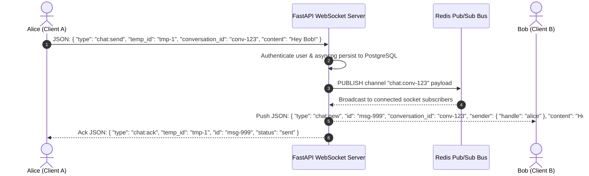
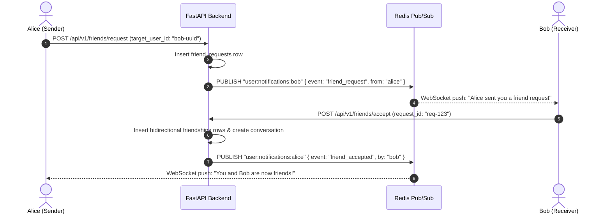

# ⚡ Project LOOP — Master Design & Architecture Specification

> **The Vision**: The definitive **pure-text social platform with Discord-grade real-time voice & chat**, combining the absolute best of **Discord, WhatsApp, X (Twitter), and Telegram** in a jaw-dropping **Technical Authenticity & Quiet Luxury aesthetic** (5-tier obsidian surface ladder + Modern Apple Blue `#007aff` and Bright Apple Green `#30d158` accents). Built entirely around a **clean, spam-free Mutual Friend System** (`[ + Add Friend ]` / `[ Accept ]`), eliminating one-way follow confusion. **100% solid, flat, and opaque—zero glassmorphism, zero transparency, zero frosted blur.** Just sharp text, sub-20ms chat delivery, full Discord audio hardware device controls, and crystal-clear <40ms voice channels with automatic reconnection.

---

## 1. The Best of Discord, WhatsApp, X & Telegram (Feature Matrix)

```mermaid
flowchart TD
    subgraph Giants ["The 4 Best-of-Breed Foundations"]
        Discord["Discord\n• Pure Mutual Friend System (Add Friend / Accept / Decline)\n• 1-Tap Persistent Voice Channels (Sub-40ms LiveKit SFU)\n• Input/Output Device Selector (Mic & Headphone) + Mic Test VU Bar\n• Auto-Reconnect with ICE Restart & Connection Quality Meter\n• Voice Activity Detection (VAD) & Active Speaker Bright Green Glow Rings"]
        WhatsApp["WhatsApp\n• Sub-20ms Direct Messages & Group chats with zero spam\n• Read receipts & delivery ticks (✓, ✓✓, ✓✓ blue)\n• In-reply-to quote preview bubbles in chat\n• Pin top conversations & mute/archive chats\n• Clean split-pane desktop messaging"]
        X["𝕏 / Twitter\n• Chronological Friends Feed & Global Discover pulse\n• Micro-post composer (≤300 chars) with progress ring\n• Threaded replies with connector hairlines\n• Bookmarks, Pin to profile & Edit post window"]
        Telegram["Telegram\n• Broadcast Channels / Public Circles for creators\n• Search history inside any DM conversation\n• 'Saved Messages' personal private scratchpad\n• Keyboard-first shortcuts & instant navigation"]
    end

    subgraph ProductCore ["LOOP's Unified Engine"]
        Friends["🤝 Spam-Free Mutual Friend System\nZero follow confusion. Only mutual friends can DM & share feeds."]
        Voice["🎙️ 1-Tap Discord Voice Channels\nDrop in/out freely, LiveKit SFU + Opus 48kHz (Sub-40ms latency, persistent bottom dock)"]
        Speed["⚡ Sub-20ms WebSocket Chat\nInstant optimistic updates for feed, likes, and messages"]
        Palette["⚡ Global Command Palette (Cmd+K)\nJump to any friend, chat, voice lounge, or action in 1 keystroke"]
        Design["🎨 5-Tier Obsidian Surface Ladder + Apple Blue (#007aff) & Bright Green (#30d158)\n100% Solid matte surfaces with 1px precision optical hairlines"]
    end

    Giants --> ProductCore
```



---

## 2. Complete Essential Feature Catalog

### A. The Spam-Free Mutual Friend System (Discord + WhatsApp Model)
*No one-way asymmetric follows. No confusion over who can message whom. Everything is clean, reciprocal, and high-signal.*

1. **Friend Requests (`[ + Add Friend ]` / `[ Accept ]` / `[ Decline ]`)**:
   - Send a friend request by clicking **`[ + Add Friend ]`** on any profile, hover card, or by searching their `@handle`.
   - Receiver gets an instant real-time notification with 1-tap `[ Accept ]` or `[ Decline ]`.
   - Once accepted, both users become **Mutual Friends** (`🤝 Friends`).
2. **Clean, Uncluttered DMs**:
   - Only accepted mutual friends appear in your DM conversation list.
   - Zero unsolicited spam inboxes, zero stranger message requests.
3. **Friend Status Indicators**:
   - Live presence indicator on friend avatars: **Bright Green (`#30d158`)** when online + custom text status (e.g. `💬 "building loop"`, `⚡ "deep work"`).
4. **Pending Requests Manager**:
   - Dedicated tab in Notifications / Friends list to review incoming and outgoing friend requests.

---

### B. The Feed & Stream (Friends Stream + Discover Pulse)
1. **Dual Feed Engine**:
   - `Friends`: 100% pure chronological stream of thoughts from your **accepted mutual friends** (zero ads, zero algorithms, high intimacy).
   - `Discover`: Real-time global pulse of high-signal thoughts across the community to discover new people and send friend requests.
2. **Micro-Post Composer (≤300 chars)**:
   - Live Apple Blue circular SVG progress ring as you type (shifts to Amber at 280 chars, Red at 300).
   - Hotkey publish: `Cmd + Enter` / `Ctrl + Enter`.
   - Rich text formatting: Bold (`**`), Italic (`*`), Inline Code (`` `code` ``), and Blockquotes (`>`).
3. **Post Interactions**:
   - **Like / Heart**: Tactile numeric odometer ticker (`tabular-nums`) with 120ms spring scale bounce (`scale(1.2) -> scale(1.0)`) and Pink/Red (`#ff375f`) glow.
   - **Repost / Echo**: 1-Tap repost directly to your friends.
   - **Quote Thought**: Repost with your own commentary attached above the original card.
   - **Threaded Nested Replies**: Clean vertical connector hairlines with indented responses.
   - **Bookmark / Save**: 1-Click save to your private `Bookmarks` tab.
   - **Post Edit Window**: Edit typos within 15 minutes of posting (displays a subtle `(edited)` label).
   - **Pin to Profile**: Pin up to 3 of your best thoughts to the top of your profile.
   - **Emoji Micro-Reactions**: Add instant reactions (`🔥`, `⚡`, `❤️`, `👀`, `🧠`, `🚀`) below any post.

---

### C. Discord-Style Voice Channels & Audio Hardware Settings (LiveKit SFU + Opus)

#### 1. 1-Tap Voice Channel Drop-in & Lounges
- Click any voice channel (e.g. `🔊 #general-lounge`, `🔊 #builders`, `🔊 #chill`) to immediately connect to the audio room.
- Channel participant list shows which friends are currently inside with **Bright Green (`#30d158`) active speaking rings**.
- Leave whenever you want with `Esc` or the Disconnect button.

#### 2. Discord-Style Audio Device Configuration (`Settings -> Voice & Audio`)
- **Input Device Selector (Microphone)**: Real-time dropdown populated via `navigator.mediaDevices.enumerateDevices()` (e.g. `MacBook Pro Microphone`, `AirPods Pro`, `USB Mic - Blue Yeti`).
- **Output Device Selector (Headphones/Speakers)**: Dropdown with output sink routing via `HTMLMediaElement.setSinkId()` (e.g. `AirPods Pro`, `External Speakers`, `Default System Output`).
- **"Let's Check Your Mic" Live VU Meter & Audio Test**:
  - Live animated audio level bar (green gradient) showing current decibel input.
  - Optional `Mic Test` toggle to loop audio back to your headphones with 0ms latency to test your voice.
- **Input Sensitivity Gate**:
  - `Auto-Sensitivity` toggle (dynamic noise threshold).
  - Manual sensitivity slider (`-100 dB` to `0 dB`) to eliminate mechanical keyboard clicks and fan hum.
- **Noise Suppression & Echo Cancellation**:
  - Dedicated hardware DSP switches: `Echo Cancellation`, `Noise Suppression`, `Auto Gain Control`.

#### 3. Persistent Floating Voice Dock (Global)
- When connected, a solid obsidian dock floats at the bottom left across all routes:
  `🟢 In Voice: #general (18ms ping) · 🎙️ Mute (M) · 🎧 Deafen (D) · ⚙️ Audio Settings · 🔴 Disconnect (Esc)`
- Browse the feed, write posts, or chat in DMs while talking in real-time with zero audio interruption.

#### 4. Seamless Auto-Reconnection & Fast ICE Restart
- If the user's Wi-Fi drops, switches to cellular, or encounters network jitter, the WebRTC engine initiates an **instant ICE Restart within <500ms** without dropping the audio session.
- Connection State Indicator: Live ping meter in milliseconds (`🟢 18ms`, `🟡 110ms`, `🔴 Reconnecting...`).
- Silent JWT Token Refresh: Background token rotation so multi-hour voice sessions never disconnect.

#### 5. Per-User Volume Sliders (0% to 200%)
- Right-click / hover any participant in a voice channel to adjust their individual volume from **0% to 200%**.
- Discontinuous Transmission (DTX) drops bandwidth to 0 kbps when silent.

#### 6. Discord-Style Audio Earcons
- Subtle tactile procedural Web Audio chimes when joining a channel, disconnecting, muting, or unmuting.

---

### D. WhatsApp / Signal Desktop Chat Architecture
1. **Split-Pane Ergonomics (340px Left Rail + Fluid Chat Viewport)**:
   - Left list shows friends with live green presence dots, last message preview, unread count badges, and pinned chats.
2. **WhatsApp-Style Read Receipts**:
   - `✓` Sent to server.
   - `✓✓` Delivered to friend's active socket.
   - `✓✓` (Modern Apple Blue) Read by friend.
3. **Live Typing Indicators & Presence (Discord Style)**:
   - Rhythmic 3-dot breathing animation: *"Sarah is typing..."*.
   - Live **Bright Green status dot (`#30d158`)** (`online` / `offline`) + custom status snippet.
4. **In-Chat Quoted Replies & Code Fences**:
   - Click or swipe reply on any message to anchor a quote bubble with a 3px Apple Blue vertical bar.
   - Multi-line syntax-highlighted code blocks.
5. **Emoji & Micro-Reactions**:
   - Add instant reactions (`🔥`, `⚡`, `❤️`, `👀`, `🧠`, `🚀`) below any chat message.
6. **In-Chat Message Search**:
   - Search through the message history of any friend conversation with live keyword highlighting.
7. **"Saved Messages" (Telegram Style)**:
   - Dedicated private scratchpad conversation with yourself to jot down notes, draft thoughts, and store links.

---

### E. Profiles, Circles & Public Channels
1. **User Identity (`/@handle`)**:
   - Display name, `@handle`, bio (≤280 chars), custom status, joined date.
   - Stats Bar: `Friends: 48`, `Thoughts: 124`.
   - **Dynamic Relationship Action Buttons**:
     - If not connected: Solid Apple Blue **`[ + Add Friend ]`**
     - If request sent: Solid Charcoal **`[ Request Sent ⏳ ]`** (click to cancel)
     - If request received: **`[ Accept Friend ]` (Blue)** / **`[ Decline ]`**
     - If mutual friends: **`[ 🤝 Friends ]`** (hover reveals `Unfriend`) + **`[ 💬 Message ]`** + **`[ 🔊 Voice ]`**
2. **Profile Tabs**:
   - `Thoughts`: Root posts authored by this user (including pinned posts at top).
   - `Replies`: Public thread replies and discussions.
   - `Likes`: Posts liked by this user.
   - `Bookmarks`: Private saved thoughts (visible only to account owner).
3. **Public Broadcast Circles / Channels (Telegram Style)**:
   - Users can create a dedicated text broadcast channel where only they can post, and subscribers receive updates in real-time.
4. **Tethered Hover Cards (Linear Style)**:
   - Hovering over any `@handle` for >180ms opens a solid matte card with bio, stats, and a 1-tap `[ + Add Friend ]` or `[ 💬 Message ]` button without navigating away.

---

### F. Search, Command Palette & Settings
1. **Global Command Palette (`Cmd + K`)**:
   - Jump to any friend (`@alex`), join a voice channel (`🔊 #general`), open a chat (`#sarah`), navigate tabs, or trigger a new post in 1 keystroke.
2. **Live Search**:
   - Search users by name/handle, voice channels, and community posts by keyword or hashtag (`#minimalism`).
3. **Privacy & Security Settings**:
   - Online Presence: Toggle whether friends can see when you are active.
   - Voice Privacy: Choose input/output audio devices and test sensitivity.

---

## 3. The 2026 "Technical Authenticity & Quiet Luxury" Design System

### 3.1 5-Tier Obsidian Surface Ladder (`globals.css`)
**100% Solid & Opaque.** Depth is achieved through micro-luminance elevation rather than muddy drop shadows or translucent blur:

```css
:root {
  /* 5-Tier Obsidian Surface Ladder (Pitch Black -> Layered Matte Charcoal) */
  --bg-canvas: #050507;             /* Tier 1: Viewport Base Void */
  --bg-surface-0: #09090c;          /* Tier 2: Structural Nav Rail & Sidebar */
  --bg-surface-1: #0e0e12;          /* Tier 3: Post Cards & Message Bubbles */
  --bg-surface-2: #15151b;          /* Tier 4: Elevated Composers, Popovers, Dialogs */
  --bg-surface-hover: #1c1c24;      /* Tier 5: High-Responsiveness Hover Rows */
  --bg-surface-active: #24242f;     /* Pressed State */

  /* Precision Optical Hairlines (Crisp 1px solid lines) */
  --border-subtle: rgba(255, 255, 255, 0.07); /* Resting separator */
  --border-medium: rgba(255, 255, 255, 0.16); /* Hover state */
  --border-strong: rgba(255, 255, 255, 0.28); /* Active modal edge */
  --border-focus: #007aff;                    /* Apple Blue focus ring */

  /* High-Scannability Typography */
  --text-high: #f4f4f6;             /* Primary text: crisp off-white (15:1 contrast) */
  --text-medium: #8e8e93;           /* Secondary text: classic Apple silver */
  --text-subtle: #636366;           /* Tertiary text: timestamps, handles */
  --text-muted: #3a3a3c;            /* Disabled states, subtle placeholders */

  /* Modern Apple Blue Suite (Primary Actions, CTAs, Badges) */
  --apple-blue: #007aff;            /* Solid primary action blue */
  --apple-blue-hover: #0066d6;      /* Solid hover state for primary buttons */
  --apple-blue-subtle: rgba(0, 122, 255, 0.14); /* Badge & selection background */
  --apple-blue-glow: 0 0 16px rgba(0, 122, 255, 0.25);

  /* Modern Bright Green Suite (Live Voice, Active Mic, Online Presence) */
  --bright-green: #30d158;          /* Solid Apple Bright Green for mic/voice */
  --bright-green-glow: 0 0 16px rgba(48, 209, 88, 0.35); /* Active speaker avatar ring */
  --bright-green-subtle: rgba(48, 209, 88, 0.14); /* In-voice status chip */

  /* Auxiliary Semantic Accents */
  --status-danger: #ff453a;         /* Solid Apple Red for Disconnect & Muted mic */
  --status-warning: #ff9f0a;        /* Solid Apple Amber for Deafened state */
  --reaction-heart: #ff375f;        /* Solid Apple Pink for active Like hearts */

  /* Typography & Layout Metrics */
  --font-sans: 'Inter', -apple-system, BlinkMacSystemFont, 'Segoe UI', Roboto, sans-serif;
  --font-mono: 'JetBrains Mono', monospace;
  --radius-sm: 6px;
  --radius-md: 10px;
  --radius-lg: 14px;
}
```

### 3.2 Power-User Keyboard Navigation
| Shortcut | Action | Scope |
| :--- | :--- | :--- |
| **`j` / `k`** | Move focus down / up to the next post card | Global Feed |
| **`n`** | Open global quick-post modal | Global |
| **`c`** | Focus chat / jump to conversations | Global |
| **`m`** | Toggle microphone Mute / Unmute (when in voice channel) | Voice Dock |
| **`d`** | Toggle Deafen / Undeafen (when in voice channel) | Voice Dock |
| **`Esc`** | Disconnect voice / Close modal / collapse split-pane | Modals & Voice |
| **`/`** | Focus search input | Global |
| **`Cmd + K` / `Ctrl + K`** | Open command palette (Jump to friend, voice channel, call) | Global |
| **`Cmd + Enter`** | Submit post or reply | Composers |
| **`Enter`** | Send message (Shift+Enter for newline) | Chat input |
| **`l`** | Like the currently highlighted post | Feed |
| **`r`** | Reply to the currently highlighted post | Feed |

---

## 4. Containerized Infrastructure (`docker-compose.yml`)

The platform is 100% self-contained across 5 Docker containers:

```yaml
version: '3.8'

services:
  frontend:
    build:
      context: ./frontend
      dockerfile: Dockerfile
    container_name: loop_frontend
    ports:
      - "3000:3000"
    environment:
      - NEXT_PUBLIC_API_URL=http://localhost:8000/api/v1
      - NEXT_PUBLIC_WS_URL=ws://localhost:8000/ws
      - NEXT_PUBLIC_LIVEKIT_URL=ws://localhost:7880
    depends_on:
      backend:
        condition: service_healthy
    restart: unless-stopped

  backend:
    build:
      context: ./backend
      dockerfile: Dockerfile
    container_name: loop_backend
    ports:
      - "8000:8000"
    environment:
      - DATABASE_URL=postgresql+asyncpg://loop_user:loop_password@db:5432/loop_db
      - REDIS_URL=redis://redis:6379/0
      - LIVEKIT_API_KEY=devkey
      - LIVEKIT_API_SECRET=secret_dev_key_for_livekit_voice_service_32bytes
      - LIVEKIT_URL=http://livekit:7880
      - JWT_SECRET=loop_dev_secret_key_change_in_production_32bytes
      - JWT_ALGORITHM=HS256
      - ACCESS_TOKEN_EXPIRE_MINUTES=10080
    depends_on:
      db:
        condition: service_healthy
      redis:
        condition: service_healthy
      livekit:
        condition: service_started
    healthcheck:
      test: ["CMD", "python", "-c", "import urllib.request; urllib.request.urlopen('http://localhost:8000/health')"]
      interval: 5s
      timeout: 3s
      retries: 5
    restart: unless-stopped

  livekit:
    image: livekit/livekit-server:latest
    container_name: loop_livekit
    command: --dev --bind 0.0.0.0
    ports:
      - "7880:7880"                # LiveKit WebSocket Signaling
      - "50000-50050:50000-50050/udp" # WebRTC SFU Audio Stream
    environment:
      - LIVEKIT_KEYS=devkey: secret_dev_key_for_livekit_voice_service_32bytes
    restart: unless-stopped

  db:
    image: postgres:16-alpine
    container_name: loop_db
    environment:
      - POSTGRES_USER=loop_user
      - POSTGRES_PASSWORD=loop_password
      - POSTGRES_DB=loop_db
    volumes:
      - loop_postgres_data:/var/lib/postgresql/data
      - ./backend/init.sql:/docker-entrypoint-initdb.d/init.sql
    ports:
      - "5432:5432"
    healthcheck:
      test: ["CMD-SHELL", "pg_isready -U loop_user -d loop_db"]
      interval: 5s
      timeout: 3s
      retries: 5
    restart: unless-stopped

  redis:
    image: redis:7-alpine
    container_name: loop_redis
    ports:
      - "6379:6379"
    volumes:
      - loop_redis_data:/data
    healthcheck:
      test: ["CMD", "redis-cli", "ping"]
      interval: 5s
      timeout: 3s
      retries: 5
    restart: unless-stopped

volumes:
  loop_postgres_data:
  loop_redis_data:
```

---

## 5. PostgreSQL Database Schema (Full Relational DDL)

```sql
create extension if not exists "pgcrypto";

-- 1. Users table (Auth & Identity)
create table users (
    id uuid primary key default gen_random_uuid(),
    handle varchar(32) unique not null check (handle ~ '^[a-zA-Z0-9_]{3,32}$'),
    email varchar(255) unique not null,
    password_hash varchar(255) not null,
    display_name varchar(64) not null,
    bio varchar(280) default '',
    custom_status varchar(64) default '',
    created_at timestamptz default now(),
    updated_at timestamptz default now()
);
create index idx_users_handle on users(handle);

-- 2. Friend Requests
create table friend_requests (
    id uuid primary key default gen_random_uuid(),
    sender_id uuid not null references users(id) on delete cascade,
    receiver_id uuid not null references users(id) on delete cascade,
    status varchar(16) not null default 'pending' check (status in ('pending', 'accepted', 'declined', 'cancelled')),
    created_at timestamptz default now(),
    updated_at timestamptz default now(),
    unique (sender_id, receiver_id)
);
create index idx_friend_requests_receiver on friend_requests(receiver_id, status);

-- 3. Mutual Friendships (Bidirectional symmetric rows)
create table friendships (
    user_id uuid not null references users(id) on delete cascade,
    friend_id uuid not null references users(id) on delete cascade,
    created_at timestamptz default now(),
    primary key (user_id, friend_id)
);
create index idx_friendships_user on friendships(user_id);

-- 4. Posts & Thread Replies
create table posts (
    id uuid primary key default gen_random_uuid(),
    author_id uuid not null references users(id) on delete cascade,
    content text not null check (char_length(content) >= 1 and char_length(content) <= 300),
    parent_id uuid references posts(id) on delete cascade,       -- NULL for top-level post, UUID for reply
    repost_of_id uuid references posts(id) on delete cascade,   -- NULL unless pure repost
    is_pinned boolean default false,
    edited_at timestamptz,
    created_at timestamptz default now()
);
create index idx_posts_author_created on posts(author_id, created_at desc);
create index idx_posts_parent_id on posts(parent_id) where parent_id is not null;
create index idx_posts_created_at on posts(created_at desc);

-- 5. Likes
create table likes (
    user_id uuid not null references users(id) on delete cascade,
    post_id uuid not null references posts(id) on delete cascade,
    created_at timestamptz default now(),
    primary key (user_id, post_id)
);
create index idx_likes_post on likes(post_id);

-- 6. Bookmarks
create table bookmarks (
    user_id uuid not null references users(id) on delete cascade,
    post_id uuid not null references posts(id) on delete cascade,
    created_at timestamptz default now(),
    primary key (user_id, post_id)
);
create index idx_bookmarks_user on bookmarks(user_id, created_at desc);

-- 7. Post Emoji Reactions
create table post_reactions (
    id uuid primary key default gen_random_uuid(),
    post_id uuid not null references posts(id) on delete cascade,
    user_id uuid not null references users(id) on delete cascade,
    emoji varchar(8) not null,
    created_at timestamptz default now(),
    unique (post_id, user_id, emoji)
);
create index idx_post_reactions_post on post_reactions(post_id);

-- 8. Conversations (Direct Messages & Channels)
create table conversations (
    id uuid primary key default gen_random_uuid(),
    is_group boolean default false,
    title varchar(64),
    created_at timestamptz default now(),
    updated_at timestamptz default now()
);
create index idx_conversations_updated on conversations(updated_at desc);

-- 9. Conversation Members (Only Mutual Friends)
create table conversation_members (
    conversation_id uuid not null references conversations(id) on delete cascade,
    user_id uuid not null references users(id) on delete cascade,
    is_pinned boolean default false,
    is_muted boolean default false,
    joined_at timestamptz default now(),
    last_read_at timestamptz default now(),
    primary key (conversation_id, user_id)
);
create index idx_conv_members_user on conversation_members(user_id);

-- 10. Direct Messages
create table messages (
    id uuid primary key default gen_random_uuid(),
    conversation_id uuid not null references conversations(id) on delete cascade,
    sender_id uuid not null references users(id) on delete cascade,
    content text not null check (char_length(content) >= 1 and char_length(content) <= 2000),
    quoted_message_id uuid references messages(id) on delete set null,
    is_read boolean default false,
    edited_at timestamptz,
    created_at timestamptz default now()
);
create index idx_messages_conv_created on messages(conversation_id, created_at asc);

-- 11. Voice Channels (Discord-Style Persistent Audio Rooms)
create table voice_channels (
    id uuid primary key default gen_random_uuid(),
    name varchar(64) not null,
    topic varchar(255) default '',
    created_at timestamptz default now()
);

create table voice_channel_participants (
    channel_id uuid not null references voice_channels(id) on delete cascade,
    user_id uuid not null references users(id) on delete cascade,
    joined_at timestamptz default now(),
    primary key (channel_id, user_id)
);
create index idx_voice_participants_channel on voice_channel_participants(channel_id);
```

---

## 6. Real-Time WebSocket & Voice Channel Protocols

### 6.1 Sub-20ms Text Chat Dispatch (Redis Pub/Sub)


### 6.2 Friend Request WebSocket Push


---

## 7. Step-by-Step Build & Verification Sequence

1. **Scaffold Container Infrastructure**: Create `frontend/`, `backend/`, `init.sql`, and `docker-compose.yml` with all 5 services (`frontend`, `backend`, `livekit`, `db`, `redis`).
2. **Implement FastAPI Backend**:
   - AsyncPG connection pool & JWT authentication.
   - Friend Request & Friendship endpoints (`POST /friends/request`, `POST /friends/accept`, `POST /friends/decline`, `DELETE /friends/{id}`).
   - REST endpoints for Friends Feed/Discover/Posts/Likes/Reposts/Bookmarks/Search.
   - Native WebSocket connection hub with Redis Pub/Sub.
   - Voice channel endpoints (`GET /voice/channels`, `POST /voice/channels/{id}/join`, `POST /voice/channels/{id}/leave`) with LiveKit token minting.
3. **Build Next.js 15 Solid Monochrome + Apple Blue & Bright Green UI**:
   - `globals.css` with 5-tier obsidian surface ladder, 1px optical hairline tokens, Modern Apple Blue (`#007aff`), and Bright Apple Green (`#30d158`).
   - Spatial App Shell: 64px left floating icon rail, 600px center focus stream, 360px contextual right dock.
   - Micro-Composer with circular SVG character counter ring (color shifts to amber/red) and Apple Blue `Post` button (`Cmd+Enter`).
   - Post cards with vertical sliding numeric odometer tickers, threaded replies, and emoji reactions.
   - WhatsApp / Signal split-pane DM interface with delivery ticks (`✓`, `✓✓`, blue `✓✓`), typing indicators, and presence.
   - User profile pages with tabbed timelines (`Thoughts`, `Replies`, `Likes`, `Bookmarks`) and dynamic friend status buttons.
   - Quick Command Palette (`Cmd+K`) and keyboard navigation (`j`/`k`, `n`, `c`, `m`, `d`, `Esc`, `/`).
4. **Implement Discord Voice Channels & Audio Hardware Settings**:
   - `VoiceDock.tsx` persistent solid obsidian dock with live ping, mute, deafen, settings gear, and disconnect controls.
   - **Audio Device Settings Modal**: Microphone input dropdown, headphone output dropdown, and live VU decibel meter with "Test Mic" loopback.
   - Voice channel list showing active participants and live **Bright Green speaking indicator rings**.
   - Fast auto-reconnect and ICE restart on network jitter / Wi-Fi drops.
   - WebRTC audio hook using `@livekit/components-react` with Opus codec @ 48kHz.
   - Per-user volume sliders (0–200%) and Push-to-Talk / VAD noise suppression.
5. **End-to-End Verification**:
   - Run `docker compose up --build` and verify all 5 containers pass healthchecks.
   - Test sending a friend request from User A to User B, receiving the real-time WebSocket invite, accepting, and instantly unlocking DMs.
   - Test sub-20ms WebSocket message delivery between two friends.
   - Test microphone and output device selection with live VU meter.
   - Test joining a voice channel, verify live speaking glowing rings, mute/deafen hotkeys, and persistent audio while browsing the feed.
   - Verify keyboard navigation and responsive design across desktop and mobile viewports.
